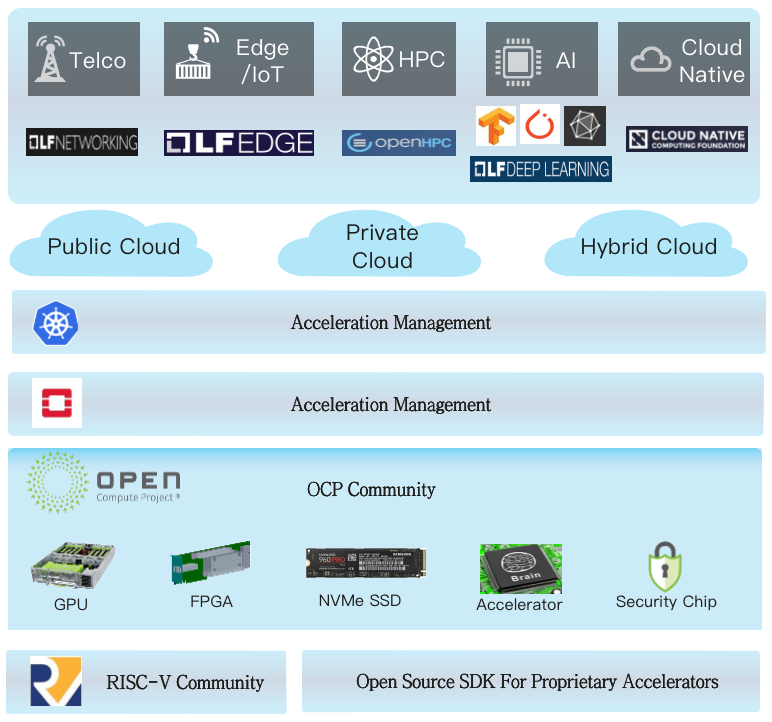

# Open Heterogeneous Computing Framework (OHCF)
Open Source Full Stack Heterogeneous Computing Reference Framework

## Motivation
Heterogeneous Computing (a.k.a domain specific accelerators such as GPU, FPGAs, SoCs, ASICs, etc) has started to play more and more important role in nascent technologies such as Artificial Intelligence, 5G, Edge Computing, Robotics, HPC, Quantum Computing, Neuromorphic Computing and so forth, most of which is offered or ran via a cloud computing platform.

However heterogeneous computing, compared to CPU-oriented general computing which has mature ecosystem from hardware to software, is still in early stage and suffers from the lack of a rich ecosystem. Hardware vendors' software ecosystem world view rarely go beyond device SDK, whereas application developers just assume their software should run on any hardware. As a result cloud platform struggle to build the bridge to connect the two, as well as address the challenges on the OS and virtualization/containerization level support.

Therefore an end-to-end full stack open source reference framework for heterogeneous computing is highly valuable, where people know how the domain specific accelerators are provided as a resource via cloud platform to the application, and how cloud platform could help applications to take advantages of these accelerator resources' particular designs.

Open Heterogeneous Computing Framework (OHCF) is proposed as a new open source initiative for this specific purpose.

## Definition
### Overview
OHCF is a lightweight overlay project working with and across major upstream open source communities such as Linux Foundation, OpenStack Foundation, OCP Foundation, RISC-V Foundation, etc. It is developer oriented and serves as a community for those are interested in accelerators to work together, build proof of concept implementations which could serve as a reference for users and vendors alike.

### Governance
OHCF is a developer oriented lightweight governed open source project, which means there will be no designated committees/boards/emeritus positions, at least in the early stage. The community will be spearheaded by those who are interested and excited about the heterogeneous computing open source implementations. Decisions will be driven by simple consensus from open discussion.

### Scope
OHCF aims to provide an open source reference framework for cloud computing powered heterogeneous computing implementations. [OpenStack](www.openstack.org) and [Kubernetes](www.kubernetes.io) will be the two main cloud computing platform OHCF's work will target. Non-cloud environment (simple single tenant clusters, blockchains) is non-priority or out of scope for OHCF.

For Hardware spec OHCF mainly targets [OCP](https://www.opencompute.org/), and [RISC-V](https://riscv.org/) for open source instruction sets. It is more than welcomed to propose additional upstream open source communities for OHCF.

### Goal/Deliverables
The main deliverables from OHCF will be reference framework in the format of either [PoC code](https://github.com/open-heterogeneous-computing-framework/PoC) or [design documentation](https://github.com/open-heterogeneous-computing-framework/community/tree/master/formula)

There will be also other types of deliverables (e.g open source [specifications](https://github.com/open-heterogeneous-computing-framework/Specs), or [open lab env](https://github.com/open-heterogeneous-computing-framework/Lab))

OHCF will however not produce integration release which would be too heavyweight. Most of the gap fulfilling features will go to respective upstream communities, and it is not the goal of OHCF to host forked major upstream implementations.

## Contribution
If you have any new idea about how we could better support accelerator ecosystem, please refer to [CONTRIBUTING](./CONTRIBUTING.md) for ways that you could participate in OHCF.

## Example Reference Framework

